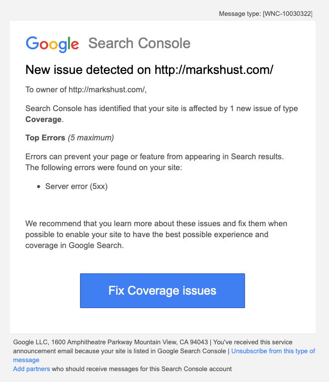
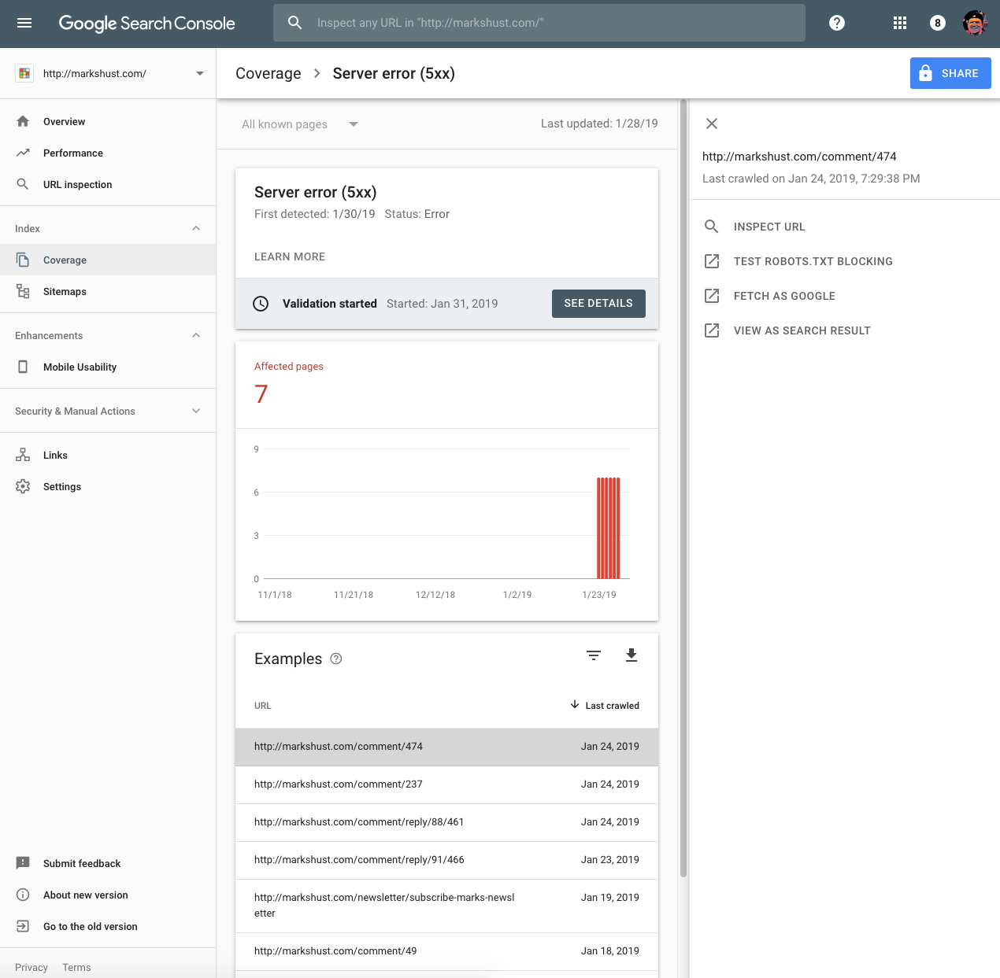

Today I woke up to a new email sitting in my inbox saying "New Coverage issue detected for site http://markshust.com/":



Clicking the "Fix Coverage Issues" button, I was sent into Google Search Console (you are using <a href="https://search.google.com/search-console/" target="_blank">Google Search Console</a>, right? It tells you all sorts of good and bad things happening with your web site). I then noticed that the comment URLs from my old Drupal blog were being returned as 404/500 server errors:



The easiest solution would be to just add some lines to a <a href="https://www.netlify.com/docs/netlify-toml-reference/" target="_blank">`netlify.toml`</a> file. This file controls all sorts of server settings and configurations you would typically see in a server configuration file. I find it much more flexible than using a <a href="https://www.netlify.com/docs/redirects/" target="_blank">`_redirects`</a> file.

I had a few entries there, so just added a few more.

<div class="gatsby-code-title">netlify.toml</div>

```toml{6-10}
[[redirects]]
  from = "/blogs/markoshust"
  to = "/"
  status = 301
  force = true
[[redirects]]
  from = "/comment/*"
  to = "/"
  status = 301
  force = true
[[redirects]]
  from = "https://markshust-com.netlify.com/*"
  to = "https://markshust.com/:splat"
  status = 301
  force = true
[[redirects]]
  from = "https://markshust-com.netlify.com/"
  to = "https://markshust.com/"
  status = 301
  force = true
```

After pushing up and deploying, I just clicked the Validation Fixed button in Google Search Console, and now the validation errors will correct themself on the next batch check.
